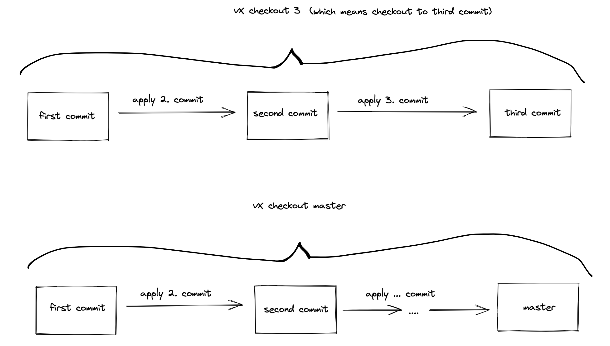
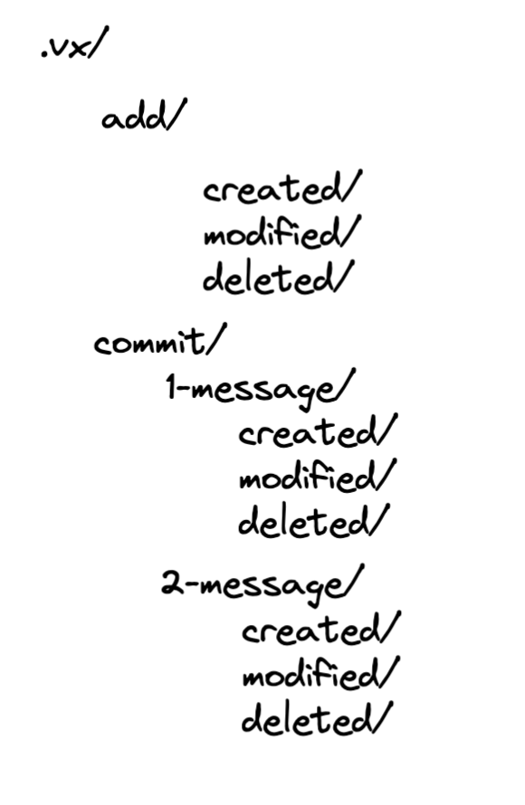

# vX
 **vX** is a very basic version control system to understand the idea of event sourcing.

# How it works?
When a user commits a file for the first time, the system saves the whole file to disk. 
Subsequent commits, reflecting changes to that file, might save only the delta—that is, just the lines that were added, 
changed, or removed. Then, when the user checks out a certain version, the system opens the version-0 file 
and applies all subsequent deltas, in order, to derive the version the user asked for.

# vX Commands
All commands: `init`, `add`, `status`, `commit`, `checkout`

**`vx init`**

**`vx add {file, directory}`**
- vx add a.go
- vx add src/

**`vx status`**

**`vx commit -m "message"`**
- vx commit -m "init"

**`vx checkout {commit_number}`**
- vx checkout 1 -> checkout to first commit
- vx checkout 10 -> checkout to tenth commit
- vx checkout master -> checkout to latest commit
- vx checkout latest -> checkout to latest commit